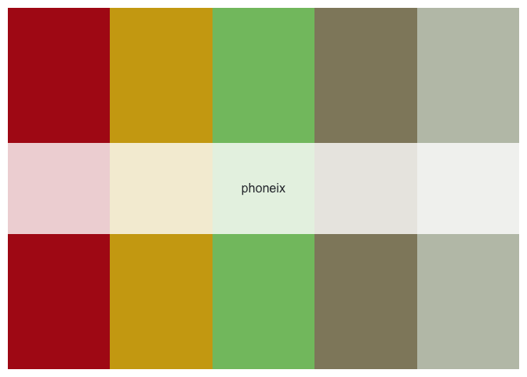
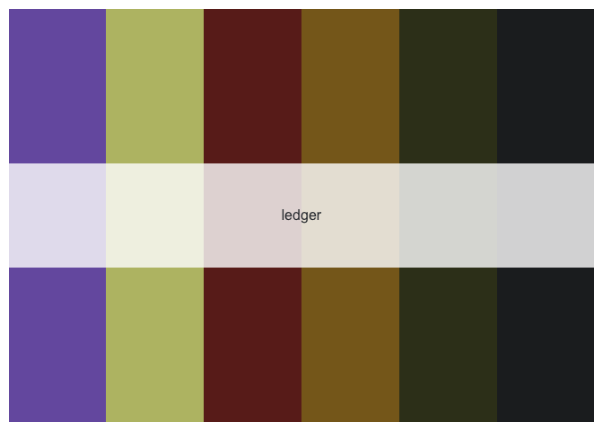
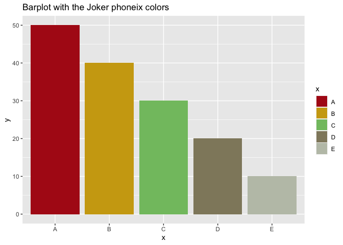
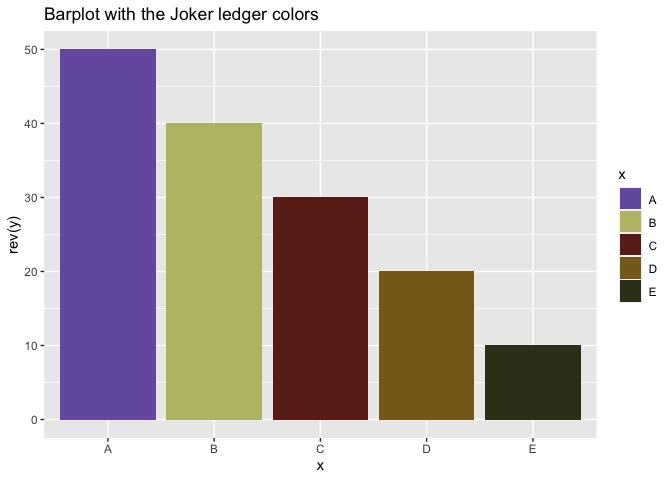

<!-- README.md is generated from README.Rmd. Please edit that file -->

# joker

<!-- badges: start -->

<!-- badges: end -->

Joker is a toy package to provide a color palette based on the Joker
character played by:

## Joaquin Phoenix in Joker 2019




## Heath Ledger in The Dark Knight 2008




## Installation

You can install the development version of joker from
[GitHub](https://github.com/) with:

``` r
# install.packages("devtools")
devtools::install_github("ahmedmoustafa/joker")
```

## Example

``` r
library(joker)
library(ggplot2)

x = c("A", "B", "C", "D", "E")
y = c(10, 20, 30, 40, 50)

ggplot() +
  geom_bar(aes(x = x, y = rev(y), fill = x), stat = "identity") +
  scale_fill_manual(values = joker("phoneix")) +
  ggtitle("Barplot with the Joker phoneix colors")
```



``` r
library(joker)
library(ggplot2)

x = c("A", "B", "C", "D", "E")
y = c(10, 20, 30, 40, 50)

ggplot() +
  geom_bar(aes(x = x, y = rev(y), fill = x), stat = "identity") +
  scale_fill_manual(values = joker("ledger")) +
  ggtitle("Barplot with the Joker ledger colors")
```


